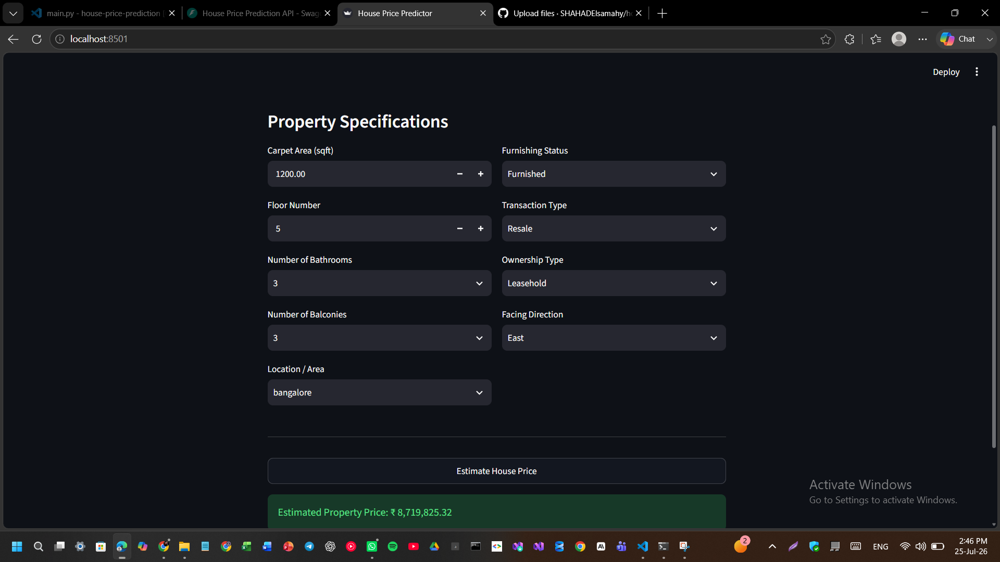

# House Price Prediction System

An end-to-end Machine Learning web application designed to predict property prices. Built with FastAPI for the backend and Streamlit for the frontend interface.

---

## Project Screenshots

### 1. Interactive User Interface (Streamlit)


### 2. Backend & Model Integration


### 3. API Documentation (Swagger UI)


---

## How to Run Locally

### 1. Start Backend (FastAPI)
```bash
cd backend
uvicorn main:app --reload

cd frontend
streamlit run app.py