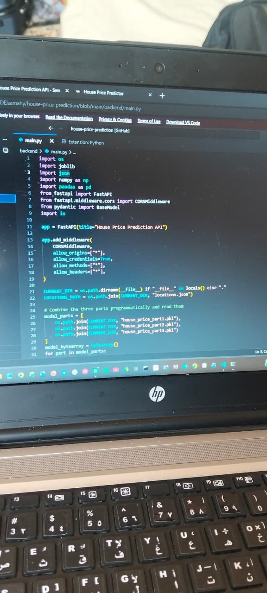

# House Price Prediction System

An end-to-end Machine Learning web application designed to predict property prices. Built with FastAPI for the backend and Streamlit for the frontend interface.

---

## 📸 Project Live Preview

### 1. Web Application Interface (Streamlit)


### 2. Backend Architecture & Model Integration


---

## 🚀 How to Run Locally

### 1. Start Backend (FastAPI)
```bash
cd backend
uvicorn main:app --reload
cd frontend
streamlit run app.py
